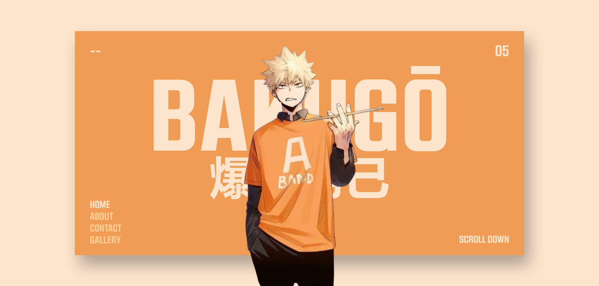

# Final Result

# HTML and CSS Documentation

## Introduction
The following document provides an overview of the provided HTML and CSS code, which constitutes the structure and style of a web page dedicated to the character Katsuki Bakugo. The page features a responsive layout and a combination of text and images to provide information about the character.

## HTML Structure
The HTML document begins with the document type declaration (DOCTYPE) and the opening `<html>` tag specifying the `lang` attribute with the value "en" for English as the default language.

Within the `<head>` tag, metadata is included to specify the encoding, viewport, and title of the page. External style sheets are also linked through `<link>` tags, and the site icon is defined.

The main content of the page is enclosed within the `<body>` tag, which includes an image of the character, a navigation bar, a scroll button, a number, and a dashed line.

## CSS Styling
The CSS starts with the definition of a custom font using `@font-face`. Custom CSS variables (--body-color, --background-color, --text-color, --unselected-text-color) are declared using `:root`.

Basic rules for the box model (`box-sizing`, `margin`, `padding`) are applied, and the default font is set for the entire page.

Rules are specified for the `<a>` and `<ul>` elements to remove link decoration and list bullet points.

The main container (class `.container`) is styled to center the content, set a background color, and apply a shadow.

The `.title-box` class contains styles for formatting the title text and the character's Japanese name.

The navigation bar (`navbar`) is positioned at the bottom left with styles for the links (`navbar-links`), including a hover transition.

The scroll button (`scroll-btn`) is positioned at the bottom right and animated with a dashed line.

## Conclusion
The provided HTML and CSS code constitute the structure and style of a web page dedicated to the character Katsuki Bakugo. The combination of images, text, and styles offers an engaging and responsive presentation of the content.